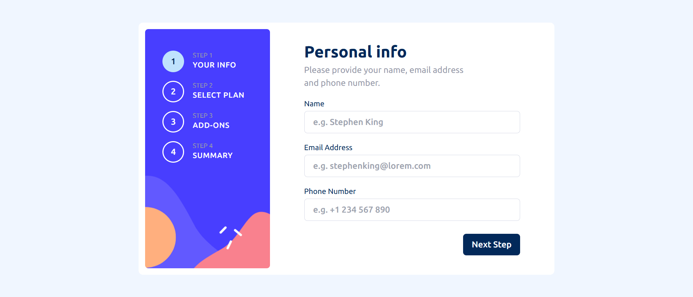
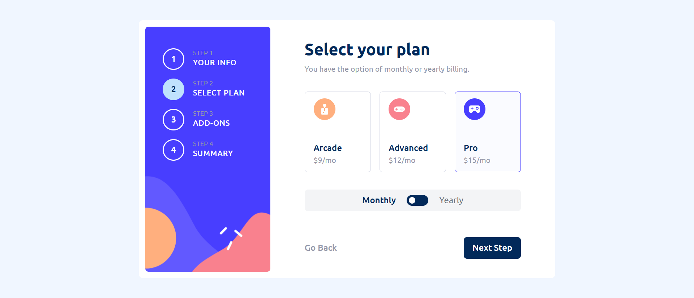
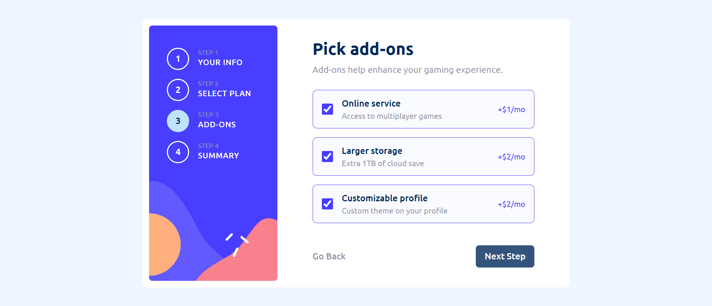
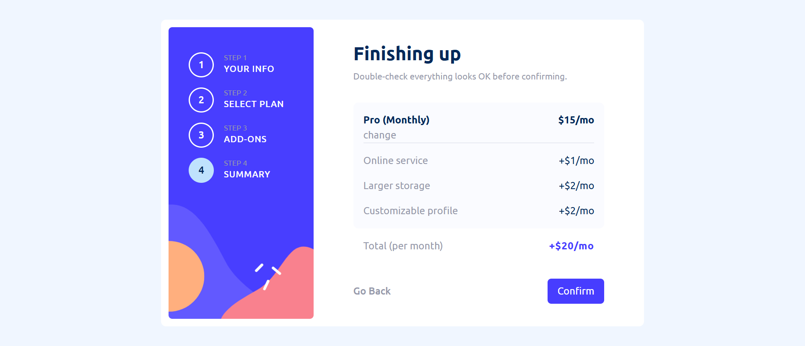
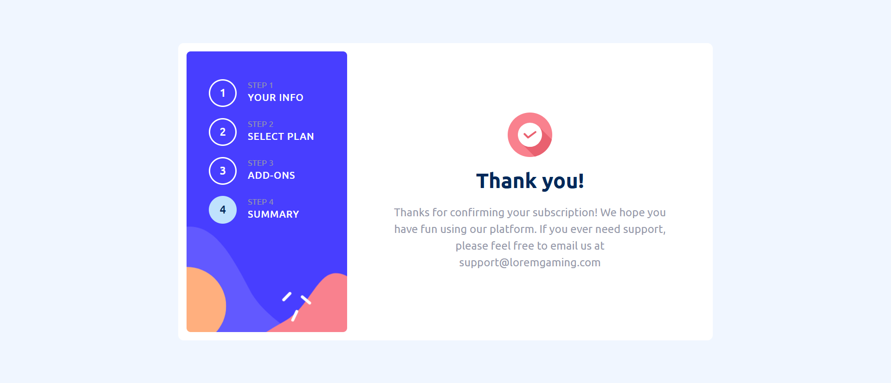

# 🧾 Multi-Step Form

A sleek and responsive multi-step form built with **React**, **Tailwind CSS**, and **Vite**. It walks users through a simple and intuitive process to fill in personal info, choose a plan, select add-ons, and review everything before submission.

## ✨ Features

- Multi-step form flow with input validation
- Dynamic pricing based on selected billing type (monthly/yearly)
- Add-on selections synced with billing choice
- Responsive design for both desktop and mobile
- Built with reusable components
- Smooth UI/UX transitions
- Deployed on [Vercel](https://vercel.com)

## 📸 Preview

<!-- Replace with your actual screenshots or links -->






## 🛠 Tech Stack

- ⚛️ React
- ⚡ Vite
- 🎨 Tailwind CSS
- ☁️ Vercel

## 📁 Folder Structure
 src/ ├── assets/ # Images and icons ├── components/ # All form steps and shared components ├── App.jsx # Root component ├── main.jsx # Entry point

 
## 🚀 Getting Started

### 1. Clone the Repository
```bash
git clone https://github.com/timi-emmanuel/multi-step-form.git
cd multi-step-form
```
### 2.  Install Dependencies
```bash
npm install
```
### 3.  Run the Development Server
```bash
npm run dev
```
Open http://localhost:5173 to view it in your browser.

## 🌐 Deployment (Vercel)
 To deploy on Vercel:

1. your code to GitHub.

2. Go to vercel.com and log in.

3. Click "New Project" and import your GitHub repo.

4. Select Vite as your framework.

5. Deploy!

## 📦 Customization Tips
- Replace icons in /src/assets/ with your own.

- Add more steps if needed — the flow is scalable.

- Images must be placed inside the public folder or imported correctly using import syntax in components for production use.


## ✅ To-Do / Improvements
- ⏳ Save progress in local storage
- ⏳ Add step transition animations
- ⏳ Integrate a backend/API for submission

## 🙌 Acknowledgments
This project was inspired by a Frontend Mentor challenge.
Feel free to customize and enhance it further!
